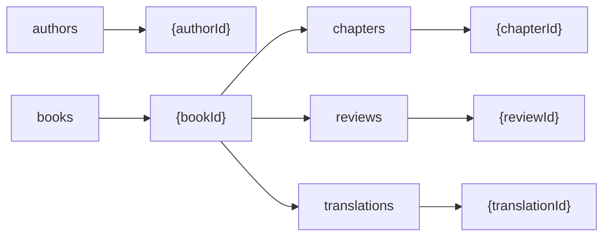

import DefinitionOption from "/snippets/cli-option-definition.mdx";
import OutFileOption from "/snippets/cli-option-out-file.mdx";
import IndentationOption from "/snippets/cli-option-indentation.mdx";
import DebugOption from "/snippets/cli-option-debug.mdx";
import ExampleDefinitionGraph from "/snippets/example-definition-graph.mdx";
import ExampleGenerationGraphBefore from "/snippets/example-generation-graph-before.mdx";
import ExampleGenerationGraph from "/snippets/example-generation-graph.mdx";

Generates a [Mermaid](https://mermaid.js.org) graph for the specified schema and injects it into the specified Markdown file. The generated graph is the visual representation of the database architecture inferred from your schema. You can specify where the graph is inserted within the file using the `--startMarker` and `--endMarker` options. For a detailed guide, see the full [example](#example) below.

## Usage

```bash
typesync generate-graph --definition <filePathOrPattern> --outFile <filePath> --startMarker <startMarker> --endMarker <endMarker> --orientation <indentation> --debug <debug>
```

## Options

<DefinitionOption />
<OutFileOption />

<ParamField type="string" path="startMarker" default="typesync-start">
  A marker that indicates the line after which the generated code should be
  inserted. Make sure to use a string that is unique within the file. The line
  containing the marker must be commented i.e. the marker needs to appear after
  the `<!--` (see [example](#example)).

  </ParamField>

<ParamField type="string" path="endMarker" default="typesync-end">
  A marker that indicates the line before which the generated code should be
  inserted. Make sure to use a string that is unique within the file. The line
  containing the marker must be commented i.e. the marker needs to appear after
  the `<!--` (see [example](#example)).
</ParamField>

<ParamField
  type='"vertical" | "horizontal"'
  path="orientation"
  default="horizontal"
>
  The orientation of the generated Mermaid graph. Can be either `"vertical"` or
  `"horizontal"` which correspond to the `"TB"` and `"LR"` Mermaid options,
  respectively.
</ParamField>

<DebugOption />

## Example

Suppose you have a schema definition file named `models.yml` and a Markdown file named `graph.md`.

<CodeGroup>
  <ExampleDefinitionGraph />
  <ExampleGenerationGraphBefore />
</CodeGroup>

To generate a Mermaid graph for the defined models and inject them between the `typesync-start` and `typesync-end` markers in the `graph.md` file, you can run the following command:

```bash
typesync generate-graph --definition definition.yml --outFile graph.md --startMarker typesync-start --endMarker typesync-end
```

Once you run the command, Typesync inserts the Mermaid graph definition into the specified section.

<ExampleGenerationGraph />

The graph generated for the above schema looks as follows:


