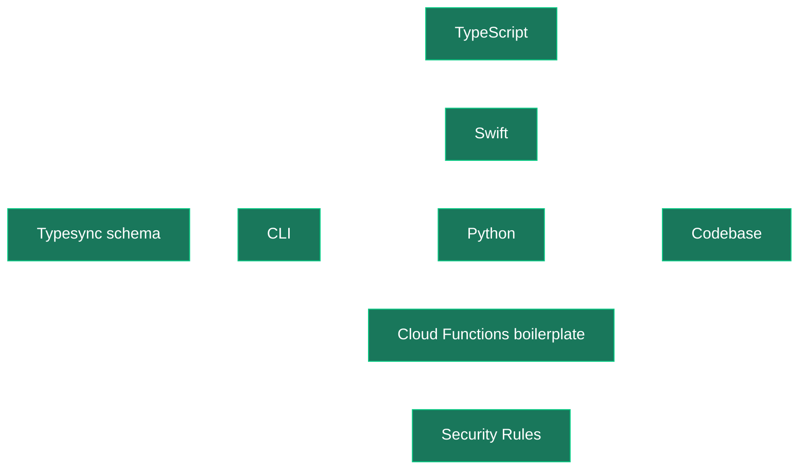

Typesync is an open-source schema management tool for [Firestore](https://cloud.google.com/firestore). It allows you to maintain a single source of truth for your Firestore architecture. With this schema in place, you can effortlessly auto-generate type definitions for multiple platforms like TypeScript, Python, Swift and more using the CLI tool. Typesync also lets you generate other useful things like Firestore Rules, Cloud Functions boilerplate and documentation for your models.



## Typesync in 30 seconds

You define your Firestore schema in a collection of YAML files. The Typesync CLI reads these files and produces ready-to-use Firestore model definitions for all the languages and platforms you work with.

In the example below we generate model definitions for 3 platforms:

<CodeGroup>

```bash TS (frontend)
typesync generate --platform ts:firebase:10 --definition models.yml # ... other options
```

```bash TS (backend)
typesync generate --platform ts:firebase-admin:11 --definition models.yml # ... other options
```

```bash Python
typesync generate --platform py:firebase-admin:6 --definition models.yml # ... other options
```

</CodeGroup>

We define our models in `models.yml` and Typesync generates the rest of the files.

<CodeGroup>

```yaml models.yml
# yaml-language-server: $schema=https://schema.typesync.org/v0.1.json

UserRole:
  model: alias
  docs: Represents a user's role within a project.
  type:
    type: enum
    items:
      - label: Owner
        value: owner
      - label: Admin
        value: admin
      - label: Member
        value: member

User:
  model: document
  docs: Represents a user that belongs to a project.
  type:
    type: object
    fields:
      username:
        type: string
        docs: A string that uniquely identifies the user within a project.
      role:
        type: UserRole
      created_at:
        type: timestamp
```

```ts models.ts (frontend)
import type * as firestore from "firebase/firestore";

/**
 * Represents a user's role within a project.
 */
export type UserRole = "owner" | "admin" | "member";

/**
 * Represents a user that belongs to a project.
 */
export interface User {
  /**
   * A string that uniquely identifies the user within a project.
   */
  username: string;
  role: UserRole;
  created_at: firestore.Timestamp;
}
```

```ts models.ts (backend)
import { firestore } from "firebase-admin";

/**
 * Represents a user's role within a project.
 */
export type UserRole = "owner" | "admin" | "member";

/**
 * Represents a user that belongs to a project.
 */
export interface User {
  /**
   * A string that uniquely identifies the user within a project.
   */
  username: string;
  role: UserRole;
  created_at: firestore.Timestamp;
}
```

```python models.py
from __future__ import annotations

import enum
import pydantic

# [static declarations redacted for brevity]

class UserRole(enum.Enum):
    """
    Represents a user's role within a project.
    """

    Owner = "owner"
    Admin = "admin"
    Member = "member"

class User(TypesyncModel):
    """
    Represents a user that belongs to a project.
    """

    username: str
    role: UserRole
    created_at: datetime.datetime

    class Config:
        use_enum_values = True

    def __setattr__(self, name: str, value: typing.Any) -> None:
        super().__setattr__(name, value)
```

</CodeGroup>

Once we have the generated models, we can import and use them in our application code.

<CodeGroup>

```ts app.ts (frontend)
import {
  getFirestore,
  doc,
  getDoc,
  collection,
  type CollectionReference,
} from "firebase/firestore";
import type { User } from "./models";

const firestore = getFirestore();
const usersColRef = collection(firestore, "users") as CollectionReference<User>;
const userDocRef = doc(usersColRef, "adam");
const userSnap = await getDoc(userDocRef);
const user = userSnap.data(); // is a User object (or undefined)
```

```ts app.ts (backend)
import { firestore } from "firebase-admin";
import type { User } from "./models";

const usersColRef = firestore().collection(
  "users"
) as firestore.CollectionReference<User>;
const userSnap = await usersColRef.doc("adam").get();
const user = userSnap.data(); // is a User object (or undefined)
```

```python app.py
import firebase_admin
from datetime import datetime
from models import User, UserRole

def initialize_firestore():
    service_account_path = './service-account.json'
    cred = credentials.Certificate(service_account_path)
    firebase_admin.initialize_app(cred)
    return firestore.client()

db = initialize_firestore()

user = User(
    username="johnappleseed",
    role=UserRole.Owner,
    created_at=datetime.now()
)
doc_ref = db.collection('users').document("adam")
doc_ref.set(user.model_dump())
```

</CodeGroup>

## Design Goals

Typesync is built on three foundational principles that guide its design and functionality.

### 1. Predictability (dumbness)

Typesync doesn't try to outsmart you. There are no "gotchas", no hidden configurations, no implicit assumptions. When faced with bad parameters, Typesync prefers to issue an error rather than make assumptions and try to make the most of the situation. The simple reason behind this is that we believe developer tools should not have any unexpected behaviour even if that behaviour may be considered useful for a subset of developers. This predictability means that you always know what to expect from Typesync as it does only what it promises to do. Nothing more, nothing less.

### 2. Ejectability

Flexibility is at the heart of Typesync's design. One of Typesync's key advantages is its non-intrusive nature. There is no "lock-in". Typesync is not a library that tightly attaches itself to your code. You can eject at any time by simply copy-pasting the generated output into your source code without having to refactor your code. Moving away from Typesync is as simple as integrating it.

### 3. Configurability

Everything that can be reasonably expected to be configurable is made explicitly configurable by Typesync. Whether it's defining how your schema is structured or customizing the output for different programming languages, Typesync provides you with the flexibility to make those decisions. Typesync is designed to be as customizable as possible, allowing you to tailor the tool to your project's requirements.
